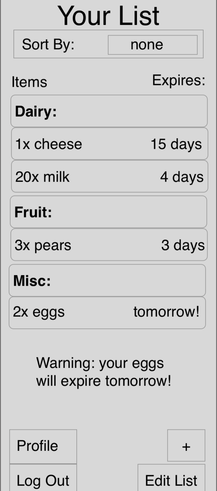
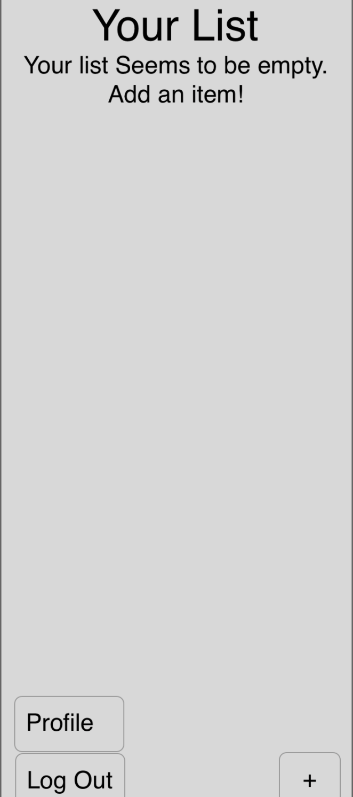
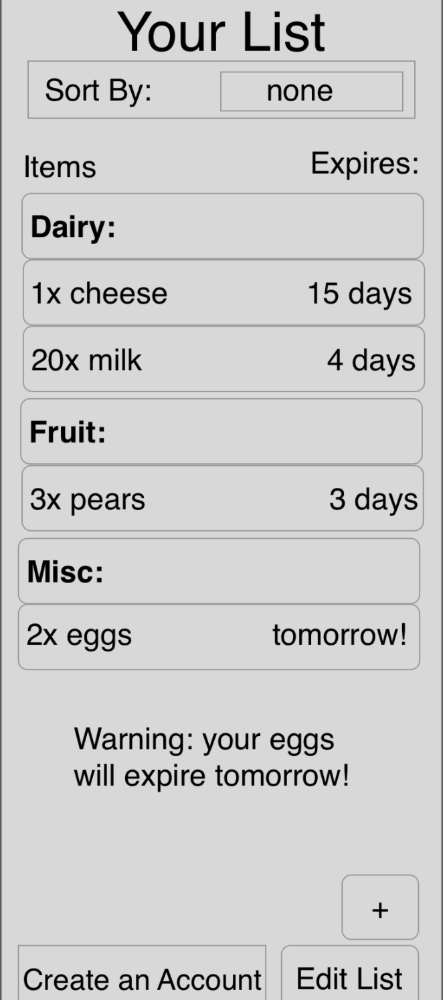
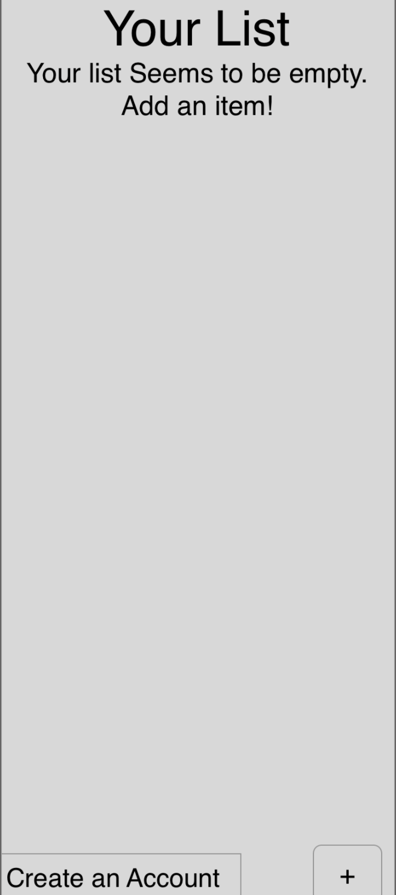
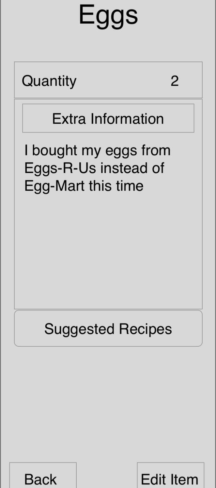
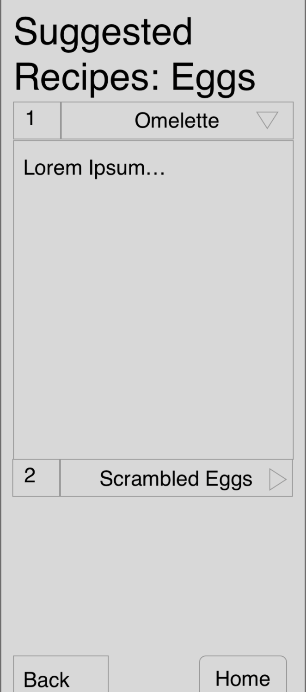
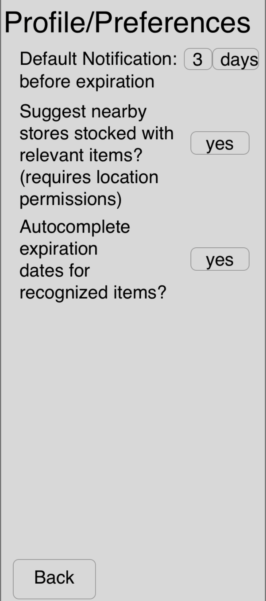

# User Experience Design
## Prototype
A link to the InVision  prototype can be found [here.](https://projects.invisionapp.com/share/3U12GBYPFYK8#/screens)
## Site Map

## Wireframes
### Wireframe 1: Home screen with Login Prompt

This is the initial page a user will see when accessing our app. It will prompt the user to login, or create an account. Additionally, there is room for an introduction to the functionality of our program below. If the user has a valid login, they will be redirected to the item page, and if they don't they will be directed toward the create account page. 

### Wireframe 2: Create account page

This page is used to create new accounts. After the user has submitted valid credentials, they will automatically be redirected to the main item page.

### Wireframe 3: User List for a logged-in user

This is the main page that displays all the items the user currently has in his/her fridge. For each entry, the name and expiration date is shown. There are also options to edit, sort, or add new entries. 

### Wireframe 4: User List for a guest user

This is the main page that displays all the items the guest currently has in his/her fridge. For each entry, the name and expiration date is shown. There are also options to edit, sort, or add new entries. 

### Wireframe 5: Add/Edit options for editing an entry

If the user wishes to add/edit an entry, this is the page they will see. They can either edit the name or the date of the product, or add a new product.

### Wireframe 6: A sort by function to sort the entries

The user has an option to sort all their items in their fridge. They can choose what they would like to filter by. 

### Wireframe 7: Inspect List Iten Page

The user can select an item they have in their inventory to inspect it further. This shows the quantity they currently have, extra information, and provides the option for some suggested recipes.

### Wireframe 8: Suggest Recipes Page

Here, the user has the option to see suggested recipes for a specific ingredient they currently have in their fridge. 

### Wireframe 9: User Profile/Preferences

This page shows the user's profile and settings. Here, they can choose whether to adjust notifications, autocomplete expirations, or edit suggestions. 
