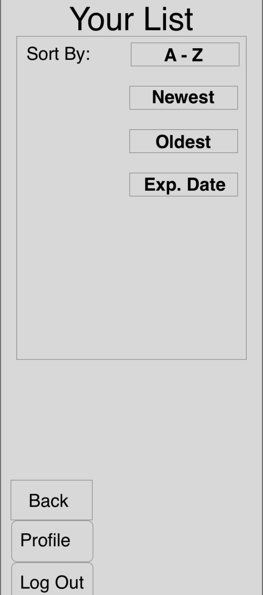

# User Experience Design

## Site Map

## Wireframes
### Wireframe 1: Home screen with Login Prompt

This is the initial page a user will see when accessing our app. It will prompt the user to login, or create an account. Additionally, there is room for an introduction to the functionality of our program below. If the user has a valid login, they will be redirected to the item page, and if they don't they will be directed toward the create account page. 

### Wireframe 2: Create account page

This page is used to create new accounts. After the user has submitted valid credentials, they will automatically be redirected to the main item page.

### Wireframe 3: Main screen that displays all the items

This is the main page that displays all the items the user currently has in his/her fridge. For each entry, the name and expiration date is shown. There are also options to edit, sort, or add new entries. 

### Wireframe 4: Edit options for editing an entry

If the user wishes to edit an entry, this is the page they will see. They can either edit the name or the date of the product. 

### Wireframe 5: Adding a new entry to the list

If the user wishes to add a new entry, this page will be shown. It will prompt the user for the name of the item, and its expected expiration date.

### Wireframe 6: A sort by function to sort the entries

Finally, the user has an option to sort all their items in their fridge. They can choose what they would like to filter by. 
